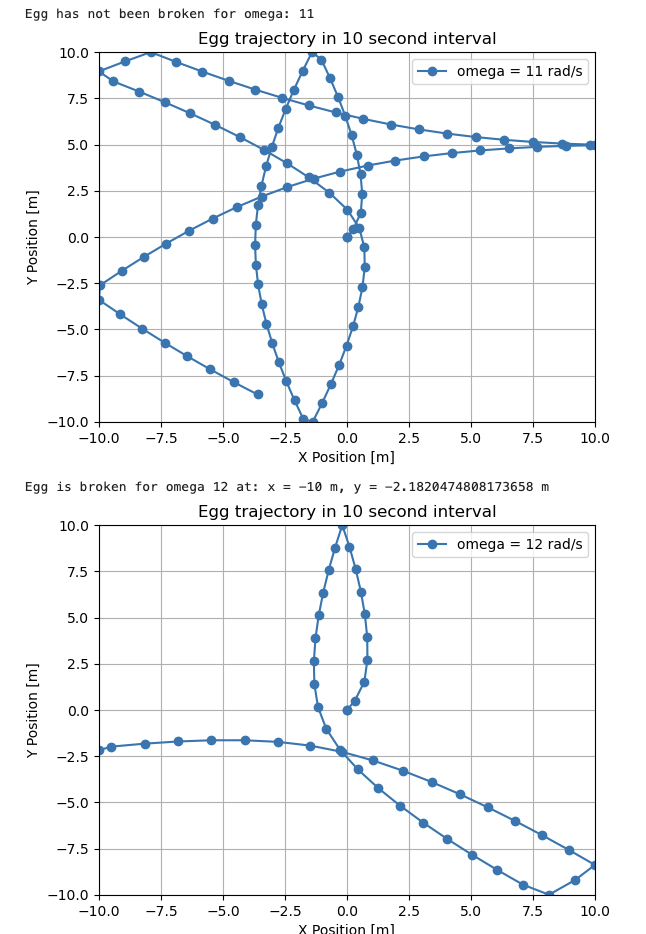
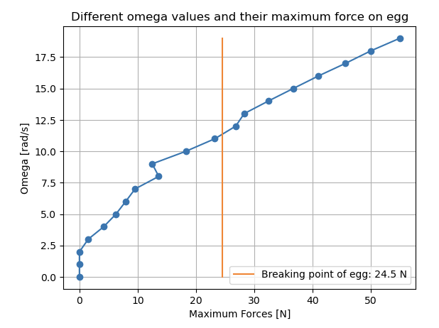
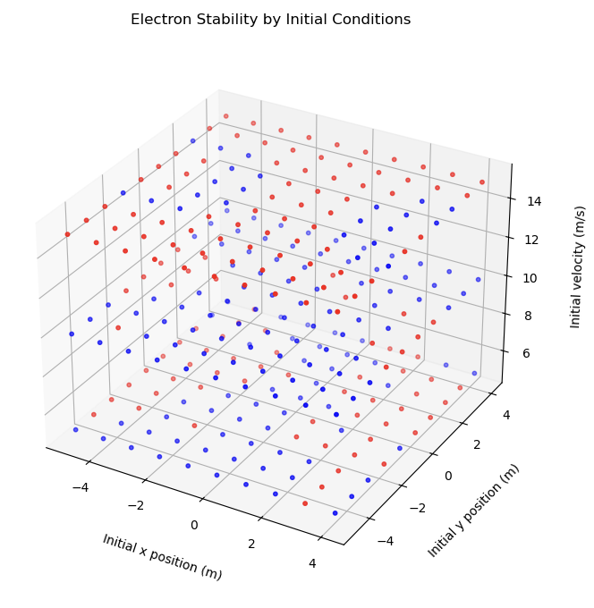
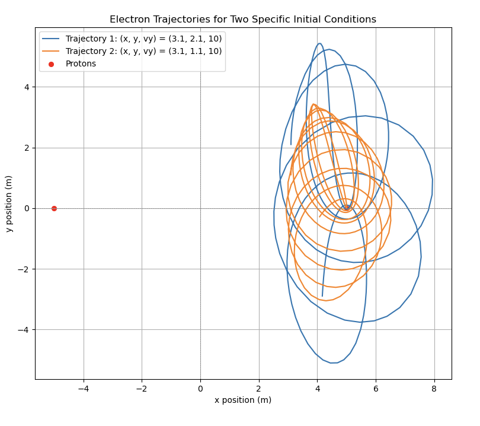
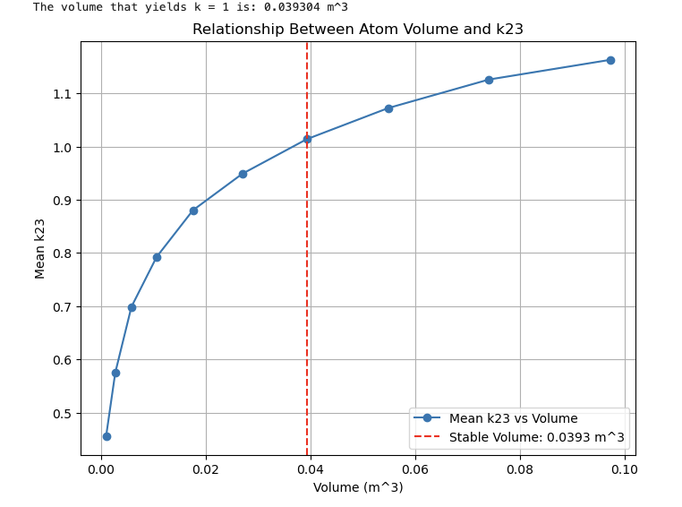
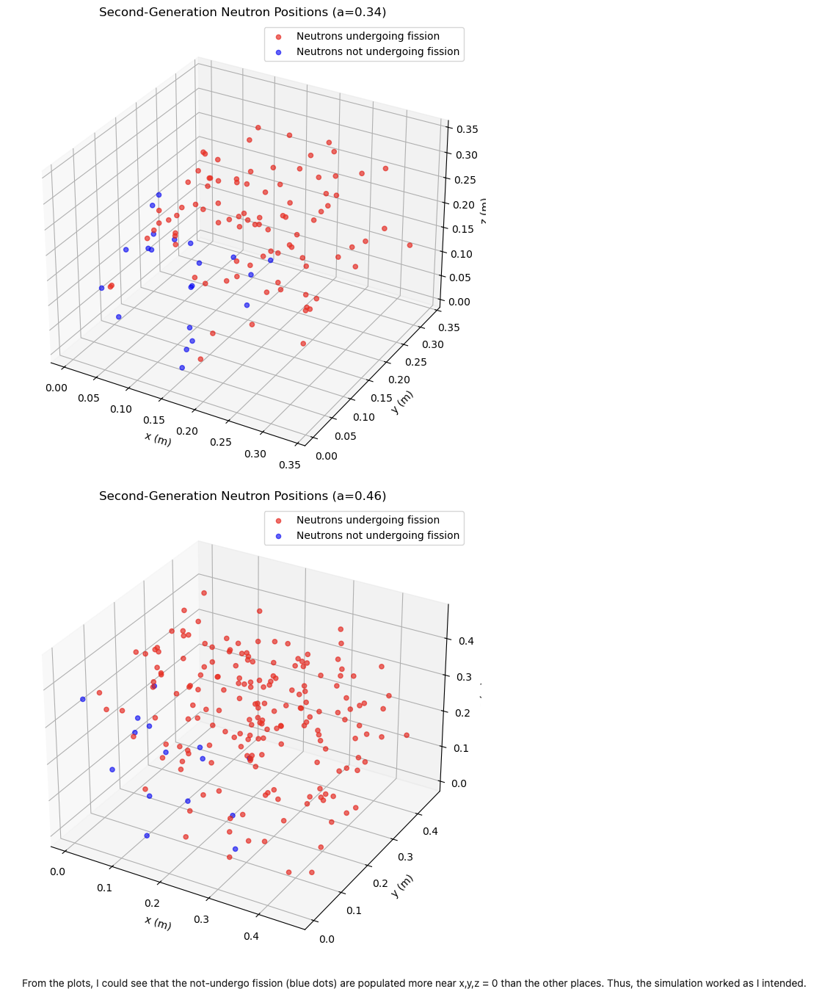

# 🧮 Physics Computational Projects

This repository contains simulation reports submitted for **PHYS 410: Computational Physics** and **PHYS 210: Introduction to Computational Physics** at UBC.  
Each project explores a different physical system using **numerical methods** — PHYS 410 in MATLAB, PHYS 210 in Python/Jupyter — with reports exported to HTML or PDF.

---

## 📁 Projects and Reports

### 1. Project 4 (PHYS 410): Galaxy Collisions with the Toomre Model

Two interacting galaxies are modeled as **massive cores** surrounded by **non-gravitating stars**.  
A **second-order finite-difference (Δt²)** scheme advances positions and velocities, verified via a **three-level convergence test**.

**Report & Media**
- 📄 [View Report (PDF)](https://github.com/tbui06/physics-projects/blob/main/reports/PHYS%20410%20Project%201.pdf)
- 🎞️ Simulation videos (playable inline):

  <video width="300" controls>
    <source src="https://github.com/tbui06/physics-projects/raw/main/toomre_l8.mp4" type="video/mp4">
  </video>
  <video width="300" controls>
    <source src="https://github.com/tbui06/physics-projects/raw/main/toomre_l9.mp4" type="video/mp4">
  </video>
  <video width="300" controls>
    <source src="https://github.com/tbui06/physics-projects/raw/main/toomre_l10.mp4" type="video/mp4">
  </video>

  Level 8 &nbsp;&nbsp;|&nbsp;&nbsp; Level 9 &nbsp;&nbsp;|&nbsp;&nbsp; Level 10

**Highlights**
- Two cores on near-glancing trajectories  
- Stars initialized on circular orbits in the xy-plane with random radii and angles  
- Tidal tails and slingshot ejections observed  
- Convergence ratio |u₈ − u₉| / |u₉ − u₁₀| ≈ 4, confirming O(Δt²)

  
  
  

  (Left) Tidal tails formed after close passage &nbsp;|&nbsp; (Middle) Position difference between Levels 8–9 and 9–10 &nbsp;|&nbsp; (Right) 4× scaling confirms second-order convergence

---

### 2. [**Project 1: Egg Break Threshold in a Rotating Box**](https://tbui06.github.io/physics-projects/project%201.html)

Simulates the motion of an egg sliding inside a 2-D rotating wooden box to find the **maximum angular velocity** (ω) at which the box can rotate without the egg breaking.  
The simulation includes fictitious forces (Coriolis, centrifugal, and friction) in a non-inertial frame and uses elastic-collision models to compute the impact force.

**Key Outputs**
- Critical angular velocity at break  
- Force vs ω graph  
- Trajectory comparisons (broken vs safe)

#### 🖼️ Example Outputs

  
  

  (Left) Trajectory of a breaking egg &nbsp;|&nbsp; (Right) Impact force versus angular velocity

---

### 3. [**Project 2: Electron Orbit Stability in a Two-Proton System**](https://tbui06.github.io/physics-projects/project%202.html)

Analyzes how an electron behaves in a 2-D electric field generated by two stationary protons.  
By scanning different initial positions and vertical velocities, the simulation determines which conditions yield **stable (bound)** or **unstable (unbound)** motion.

**Techniques**
- Coulomb-force model  
- Numerical integration with `solve_ivp`  
- Energy-based stability check (E ≤ 0 → stable)

#### 📊 Sample Results

  
  

  (Left) Stable vs unstable regions over initial conditions &nbsp;|&nbsp; (Right) Trajectories for selected cases

---

### 4. [**Project 3: Critical Volume of Impure ²³⁵U for a Self-Sustaining Chain Reaction**](https://tbui06.github.io/physics-projects/project03.html)

Simulates a 3-D fission chain reaction in a cube of impure ²³⁵U to find the volume producing a **stable third generation** of neutrons (k ≈ 1).  
Monte Carlo methods and spatially dependent fission probabilities are used.

**Findings**
- Critical volume ≈ 0.0393 m³  
- k-factor analysis across volumes  
- Validation via neutron distribution

#### 📊 Sample Results

  
  

  (Left) k-factor as a function of volume &nbsp;|&nbsp; (Right) Spatial distribution used for validation

---

## ⚙️ Notes

- PHYS 410 → MATLAB simulation and convergence analysis  
- PHYS 210 → Python simulations using `numpy`, `scipy`, `matplotlib`  
- Reports are static (PDF/HTML) — source code not included  
- Videos should be committed as **.mp4** or **.gif** for GitHub preview  

---

## 👤 Author

**Nam Bui**  
Physics Undergraduate, UBC  
[GitHub → @tbui06](https://github.com/tbui06)
